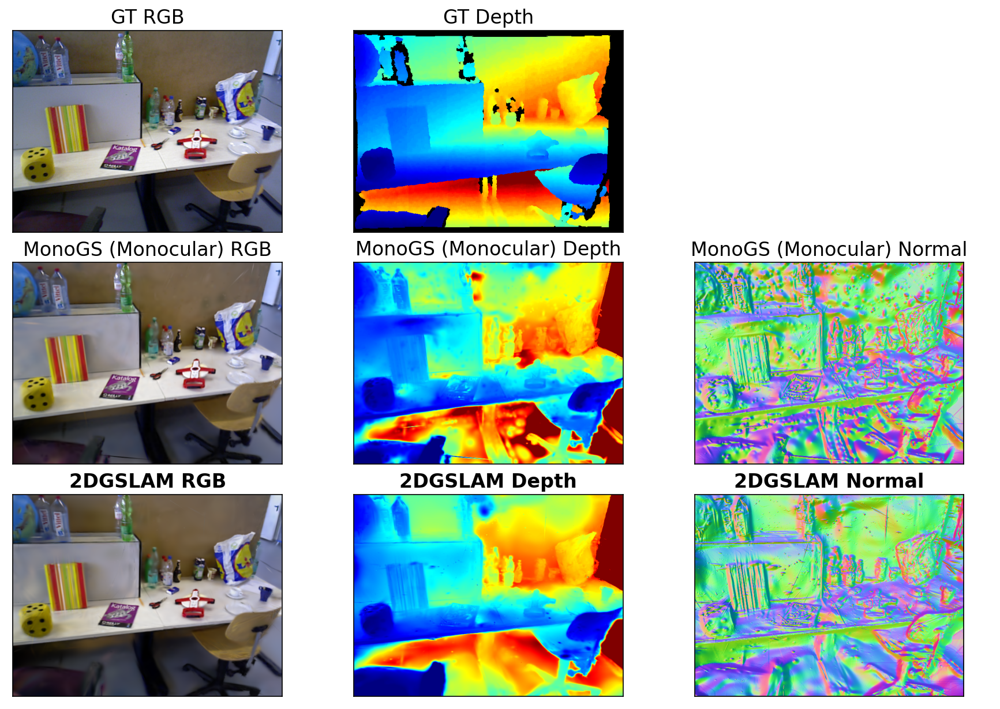

# 2DGSLAM: 2D Gaussian Splatting for Dense SLAM

This repository implements a dense SLAM system based on **2D Gaussian Splatting (2DGS)**, extending the **MonoGS** framework. By representing the scene with oriented circular disks (surfels) instead of standard 3D ellipsoids, **2DGSLAM** achieves more accurate surface modeling and high-quality geometry reconstruction.



## Getting Started
### Installation

This system requires a CUDA-enabled GPU. These instructions are verified for **Ubuntu 24.04** with **CUDA 12.8**.

The recommended environment below is the one that was successfully used to reproduce Kaggle behavior locally.

#### 1. Setup Environment
Use **Python 3.12** for best compatibility with modern PyTorch and CUDA 12. You can create the environment using the provided `environment.yml`:
```bash
conda env create -f environment.yml
conda activate 2dgslam
```

Alternatively, if you prefer using `pip` directly:
```bash
conda create -n 2dgslam python=3.12.12 -y
conda activate 2dgslam
pip install -r requirements.txt
```

#### 4. Build Submodules
The system relies on custom CUDA kernels for the 2D surfel rasterizer and KNN.


```bash
# Clone with --recursive
# (If you already cloned, run: git submodule update --init --recursive)

# 1. Apply CUDA 12 fix to simple-knn
sed -i '1i #include <cfloat>' submodules/simple-knn/simple_knn.cu

# 2. Build diff-surfel-rasterization (Custom 2dgslam version)
cd submodules/diff-surfel-rasterization
pip install . --no-build-isolation

# 3. Build simple-knn
cd ../simple-knn
pip install . --no-build-isolation

cd ../..
```

### Quick Run (TUM RGB-D)
Download a TUM sequence:
```bash
bash scripts/download_tum.sh
```
Run the system with a specific configuration:
```bash
python slam.py --config configs/rgbd/tum/fr1_desk.yaml
```

## Evaluation
To run the system in headless mode and log metrics (ATE and rendering quality):
```bash
python slam.py --config configs/mono/replica/office0.yaml --eval
```

### Quantitative Results (Monocular Comparison)

We compare **2DGSLAM** (this repo) against the **Gaussian Splatting SLAM (MonoGS)** baseline across all sequences. All results use monocular camera input.

#### 1. TUM RGB-D Dataset
| Method | Sequence | ATE RMSE (m) ↓ | Depth L1 (cm) ↓ | PSNR ↑ |
| :--- | :--- | :---: | :---: | :---: |
| 2DGSLAM | `fr1_desk` | **0.0229** | **13.62** | **17.85** |
| MonoGS | | 0.0359 | 15.13 | 17.51 |
| 2DGSLAM | `fr2_xyz` | **0.0335** | **41.00** | **15.72** |
| MonoGS | | 0.0471 | 49.55 | 15.51 |
| 2DGSLAM | `fr3_office`| 0.0368 | 30.75 | 18.64 |
| MonoGS | | **0.0253** | **28.91** | **19.50** |

#### 2. Replica Dataset (Reconstruction & Tracking)
| Method | Sequence | ATE RMSE (m) ↓ | Depth L1 (cm) ↓ | PSNR ↑ |
| :--- | :--- | :---: | :---: | :---: |
| 2DGSLAM | `office0` | 0.0959 | 15.69 | 30.79 |
| MonoGS | | **0.0696** | **12.92** | 30.79 |
| 2DGSLAM | `office1` | 0.1277 | 50.94 | 31.76 |
| MonoGS | | **0.1057** | **42.57** | **32.93** |
| 2DGSLAM | `office2` | 0.2064 | 33.95 | 24.87 |
| MonoGS | | **0.1503** | **28.37** | **26.56** |
| 2DGSLAM | `office3` | 0.0461 | 18.97 | 28.92 |
| MonoGS | | **0.0386** | **17.27** | **30.06** |
| 2DGSLAM | `office4` | **0.0351** | **11.84** | **28.94** |
| MonoGS | | 0.2387 | 39.03 | 27.75 |
| 2DGSLAM | `room0` | **0.0425** | **11.37** | **27.73** |
| MonoGS | | 0.0445 | 15.72 | 27.71 |
| 2DGSLAM | `room1` | **0.2988** | **54.75** | **25.04** |
| MonoGS | | 0.5329 | 128.28 | 24.92 |
| 2DGSLAM | `room2` | 0.0233 | **9.41** | 29.29 |
| MonoGS | | **0.0188** | 10.68 | **30.44** |

## Acknowledgments
This work is built upon:
- **MonoGS**: [Gaussian Splatting SLAM (CVPR 2024)](https://github.com/muskie82/MonoGS)
- **2DGS**: [2D Gaussian Splatting for Geometrically Accurate Radiance Fields (SIGGRAPH 2024)](https://github.com/hbb1/2d-gaussian-splatting)

## License
2DGS SLAM is released under the **LICENSE.md**.
